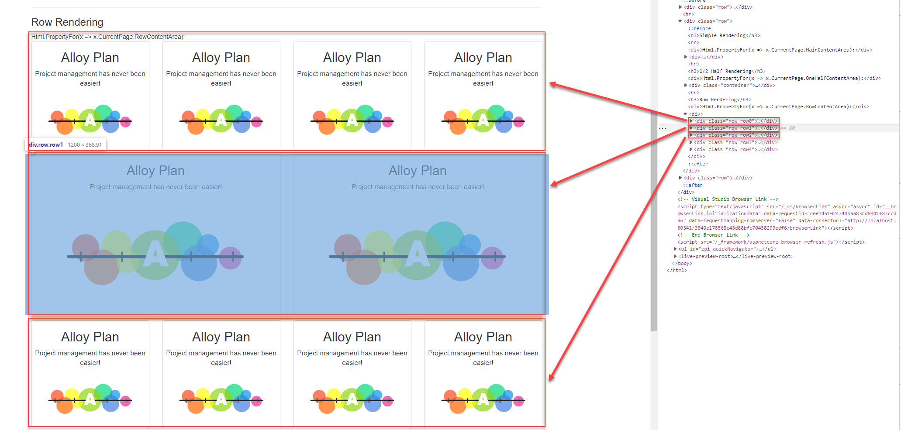

[](https://ci.appveyor.com/project/ValdisIljuconoks/epibootstraparea)

Optimizely Advanced Content Area Renderer
================

Provides easy way to register display options used to customize look and feel of the blocks inside your Optimizely content area (+ many more advanced features and whistles).

## Optimizely versions Support

For Optimizely CMS v12 support please use `master` branch.

## List of Points of Interest

* [Getting Started](https://github.com/valdisiljuconoks/optimizely-advanced-contentarea/blob/master/README.md#getting-started)
* [Available Built-in Display Options](https://github.com/valdisiljuconoks/optimizely-advanced-contentarea/blob/master/README.md#available-built-in-display-options)
* [Display Option Fallbacks](https://github.com/valdisiljuconoks/optimizely-advanced-contentarea/blob/master/README.md#display-option-fallbacks)
* [Setup (Configuration)](https://github.com/valdisiljuconoks/optimizely-advanced-contentarea/blob/master/README.md#available-configuration-options)
* [Support for Optimizely.Forms](https://github.com/valdisiljuconoks/optimizely-advanced-contentarea/blob/master/docs/Optimizely-forms.md)
* [Advanced Features](https://github.com/valdisiljuconoks/optimizely-advanced-contentarea/blob/master/README.md#advanced-features)
   * [Bootstrap Row Support](https://github.com/valdisiljuconoks/optimizely-advanced-contentarea/blob/master/README.md#bootstrap-row-support)
   * [Validate Item Count to Match Bootstrap Columns](https://github.com/valdisiljuconoks/optimizely-advanced-contentarea/blob/master/README.md#validate-item-count)
   * [Default DisplayOption for Block](https://github.com/valdisiljuconoks/optimizely-advanced-contentarea/blob/master/README.md#default-displayoption-for-block)
   * [Default DisplayOption for Content Area](https://github.com/valdisiljuconoks/optimizely-advanced-contentarea/blob/master/README.md#default-displayoption-for-content-area)
   * [Get Block Index in the ContentArea](https://github.com/valdisiljuconoks/optimizely-advanced-contentarea/blob/master/README.md#get-block-index-in-the-contentarea)
* [Customize Bootstrap Content Area](https://github.com/valdisiljuconoks/optimizely-advanced-contentarea/blob/master/README.md#customize-bootstrap-content-area)
    * [Add DisplayOptions to ConfigurationContext](https://github.com/valdisiljuconoks/optimizely-advanced-contentarea/blob/master/README.md#add-displayoptions-to-configurationcontext)
    * [Provider Model](https://github.com/valdisiljuconoks/optimizely-advanced-contentarea/blob/master/README.md#provider-model)
    * [Register Custom Provider](https://github.com/valdisiljuconoks/optimizely-advanced-contentarea/blob/master/README.md#register-custom-provider)
    * [Customize Generated Css Classes](https://github.com/valdisiljuconoks/optimizely-advanced-contentarea/blob/master/README.md#customize-generated-css-classes)
    * [Customize Generated Css Classes](https://github.com/valdisiljuconoks/optimizely-advanced-contentarea/blob/master/README.md#customize-generated-css-classes)
    * [Additional Styles](https://github.com/valdisiljuconoks/optimizely-advanced-contentarea/blob/master/README.md#additional-styles)
    * [Localized Display Option Names](https://github.com/valdisiljuconoks/optimizely-advanced-contentarea/blob/master/README.md#localized-display-option-names)
    * [Modify Block Start Element](https://github.com/valdisiljuconoks/optimizely-advanced-contentarea/blob/master/README.md#modify-block-start-element)
    * [Skip Item Wrapper Element](https://github.com/valdisiljuconoks/optimizely-advanced-contentarea/blob/master/README.md#skip-item-wrapper-element)

## Getting Started

You would need to install package from Optimizely's NuGet [feed](https://nuget.optimizely.com/package/?id=TechFellow.Optimizely.AdvancedContentArea) to start using Twitter's Bootstrap aware Optimizely Content Area renderer:

```
> dotnet add package TechFellow.Optimizely.AdvancedContentArea
```

Next you would need to configure renderer by adding it to the application:

```csharp
public class Startup
{
    public void ConfigureServices(IServiceCollection services)
    {
        services.AddAdvancedContentArea(o =>
        {
            o.DisplayOptions = DisplayOptions.Default;
        });
    }
}
```

## Configuration

Following configuration options are available:

| Name | Default | Description |
|------|---------|-------------|
| `DisplayOptions` | Empty list | Specify list of display options available for the renderer. Later editors will be able to choose any of these options while creating content and specifying dispay option for blocks. |
| `RowSupportEnabled` | `false` | Configure if advanced content area renderer should support row option. |
| `AutoAddRow` | `false` | Configure renderer to add automatically new row when item count in the content area reaches row limit. |

## Available Built-in Display Options

Following display options are available by default (via `DisplayOptions.Default`):
* Full width (`displaymode-full`)
* Half width (`displaymode-half`)
* One-third width (`displaymode-one-third`)
* Two-thirds width (`displaymode-two-thirds`)
* One-quarter width (`displaymode-one-quarter`)
* Three-quarter width (`displaymode-three-quarters`)


### Display Option Fallbacks
For every display option there are 4 fallback width for various screen sizes based on Bootstrap grid system. According to Bootstrap v3 [specification](http://getbootstrap.com/css/#grid-options) following screen sizes are defined:
* Large screen (>= 1200px)
* Medium devices (>= 992px && < 1200px)
* Small devices (>= 768px && < 992px)
* Extra small devices (< 768px)

These numbers are added at the end of Bootstrap grid system class (for instance 12 for Large screen -> `'col-lg-12'`)

| Display Mode Name   | Extra small devices | Small devices | Medium devices | Large screen |
|---------------------|---------------------|---------------|----------------|--------------|
|Full width           |12                   |12             |12              |12            |
|Half width           |12                   |12             |6               |6             |
|One third            |12                   |12             |6               |4             |
|Two thirds           |12                   |12             |6               |8             |
|One quarter          |12                   |12             |6               |3             |
|Three quarters       |12                   |12             |6               |9             |


Eventually if you choose `Half-width` display option for a block of type `EditorialBlockWithHeader` following markup will be generated:

```xml
<div class="block editorialblockwithheader col-lg-6 col-md-6 col-sm-12 col-xs-12 displaymode-half">
    ...
</div>
```

Breakdown of added classes:
* `block` : generic class added to identify a block
* `{block-name}` : name of the block type is added (in this case `EditorialBlockWithHeader`)
* `col-xs-12` : block will occupy whole width of the screen on extra small devices
* `col-sm-12` : block will occupy whole width of the screen on small devices
* `col-md-6` : block will occupy one half of the screen on medium devices
* `col-lg-6` : block will occupy one half of the screen on desktop
* `displaymode-half` : chosen display option name is added

### Example
Let's take a look at `One quarter width` block.
This is a block layout in Optimizely content area on-page edit mode (desktop view - large screen `col-lg-3`):


This is a block layout in Optimizely content area on medium devices - `col-md-6`:


This is a block layout in Optimizely content area on small and extra small devices - `col-sm-12` and `col-xs-12`:


## Advanced Features

### Bootstrap Row Support

If you need to support Boostrap row elements in Content Area, you can just render that area with `"rowsupport"` parameter:

```
@Html.PropertyFor(m => m.MainContentArea, new { rowsupport = true })
```

For every collection of elements that fill up 12 columns - additional element (`<div>`) will be wrapped around with `class="row"`.



If you need to add custom Css class to your `row` element, it's possible via `ViewData` object. Pass in `rowcssclass` parameter with desired class name:

```
    @Html.PropertyFor(x => x.CurrentPage.MainContentArea, 
                      new
                      {
                          rowsupport = true,
                          rowcssclass = "special-row"
                      })
```

### Validate Item Count

Thanks to [Jon Jones](http://www.jondjones.com/learn-Optimizely-cms/Optimizely-developers-guide/Optimizely-content-areas/how-to-add-bootstrap-row-validation-within-your-Optimizely-content-areas) for copyright! If you have Content Area with single row and want to validate item count inside to match single Bootstrap row (12 columns), you just need to add `[BootstrapRowValidation]` attribute:

```
public class StartPage : SitePageData
{
    ...
    [BootstrapRowValidation]
    public virtual ContentArea MainContentArea { get; set; }
```

Example: you add 2 blocks to the content area with `1/2` and `2/3`. In total it's `7/6` of the width - which exceeds full width columns `12/12`.

### Default DisplayOption for Block

You can specify which display option to use if block is dropped inside content area and editor did not specify display option explicitly:

```csharp
using TechFellow.Optimizely.AdvancedContentArea;

public static Class ContentAreaTags  
{
    public const string HalfWidth = "half-width";
}

[DefaultDisplayOption(ContentAreaTags.HalfWidth)]
public class SomeBlock : BlockData  
{
    ...
}
```

This attribute will make sure that if block is dropped inside content area - display option registered with tag `half-width` is used.

Also "tagged" blocks are supported:

```csharp
using TechFellow.Optimizely.AdvancedContentArea;

[DefaultDisplayOptionForTag("ca-tag", ContentAreaTags.OneThirdWidth)]
public class SomeBlock : BlockData
{
    ...
}
```

### Default DisplayOption for Content Area

The same attribute can be used in ContentArea property definition:

```csharp
using TechFellow.Optimizely.AdvancedContentArea;

[ContentType(DisplayName...]
public class StandardPage : PageData  
{
    [DefaultDisplayOption(ContentAreaTags.HalfWidth)]
    public virtual ContentArea MainContentArea { get; set; }
    ...
}
```

### Get Block Index in the ContentArea

If you need to get index of the current block in the ContentArea, you are able to write just following line:


```
<div>
    Index: @Html.BlockIndex()
</div>
```

### "None" Display Option
Sometimes you would like to set display option that does nothing - none of the CSS classes would be added that could mess up your site design.
For this reason there is a new built-in display option - `None`.

You can find it in :

```csharp
public void ConfigureServices(IServiceCollection services)
{
    services.AddAdvancedContentArea(o =>
    {
        o.DisplayOptions = new List<DisplayModeFallback>(DisplayOptions.Default)
        {
            DisplayModeFallback.None
        };
    });
}
```

If you set this display option on the block (in this example `"Teaser Block"` in Alloy sample site) only following classes will be added to the container element:

```html
<div class="block teaserblock displaymode-none">
    <!-- block content -->
</div>
```

### Additional Styles
Similar to Optimizely AlloyTech sample site it's possible to define custom styles for block. You have to implement `EPiBootstrapArea.ICustomCssInContentArea` interface.

```csharp
using TechFellow.Optimizely.AdvancedContentArea;

[ContentType(GUID = "EED33EA7-D118-4D3D-BD7F-88C012DFA1F8", GroupName = SystemTabNames.Content)]
public class Divider : BaseBlockData, ICustomCssInContentArea
{
    ...

    public string ContentAreaCssClass => "block-with-round-borders";
}
```

### Localized Display Option Names
You will need to add few localization resource entries in order to get localized DisplayOptions. Following entry has to be added to get localized names for default display options:

```xml
<?xml version="1.0" encoding="utf-8" standalone="yes"?>
<languages>
  <language name="English" id="en">
    <displayoptions>
      <displaymode-full>Full (1/1)</displaymode-full>
      <displaymode-half>Half (1/2)</displaymode-half>
      <displaymode-one-third>One third (1/3)</displaymode-one-third>
      <displaymode-two-thirds>Two thirds (2/3)</displaymode-two-thirds>
      <displaymode-one-quarter>One quarter (1/4)</displaymode-one-quarter>
      <displaymode-three-quarters>Three quarters (3/4)</displaymode-three-quarters>
    </displayoptions>
  </language>
</languages>
```


### Modify Block Start Element
If there is a requirement to modify start element tag for the block (i.e. add `id` attribute to element as shown in this [blog post](http://blog.tech-fellow.net/2015/09/07/create-Optimizely-site-menu-out-of-block-driven-content/)) you can inherit from built-in bootstrap renderer (`ContentAreaRenderer`) and set element start tag modification callback:

```csharp
[ModuleDependency(typeof (SwapRendererInitModule))]
[InitializableModule]
public class SwapBootstrapRendererInitModule : IConfigurableModule
{
    public void ConfigureContainer(ServiceConfigurationContext context)
    {
        context.Services.Intercept<ContentAreaRenderer>((_, __) =>
            new AnotherBootstrapAwareContentAreaRenderer());
    }

    public void Initialize(InitializationEngine context) {}

    public void Uninitialize(InitializationEngine context) {}
}


public class AnotherBootstrapAwareContentAreaRenderer : BootstrapAwareContentAreaRenderer
{
    public AnotherBootstrapAwareContentAreaRenderer()
    {
        SetElementStartTagRenderCallback(ModifyBlockElement);
    }

    private void ModifyBlockElement(HtmlNode blockElement, ContentAreaItem contentAreaItem, IContent content)
    {
        // TODO: modification logic here...
        // for example: blockElement.Attributes.Add("id", content.GetContentBookmarkName());
    }
}
```

This will make sure that your registered `AnotherBootstrapAwareContentAreaRenderer` renderer will be used instead of built-in one. And you will have chance to modify start element of the block before it's sent to the output writer.'
**NB!** You have to use `Intercept` method to overwrite renderer (just registering new implementation for `ContentAreaRenderer` did not do the trick).

### Skip Item Wrapper Element
By default Optimizely will generate wrapping element around content area (`div` tag name is actually controllable as well, more info [here](http://blog.tech-fellow.net/2015/06/11/content-area-under-the-hood-part-3/)):

```
@Html.PropertyFor(m => m.PageHeaderArea)
```

Resulting in:

```html
<div>                 <!-- CA wrapper element -->
    <div ...>         <!-- Block element -->
        <...>         <!-- Actual content of the block -->
    </div>
</div>
```

Optimizely gives you an option to skip wrapper element generation - resulting only in set of blocks added to the content area.

```
@Html.PropertyFor(m => m.PageHeaderArea, new { HasContainer = false })
```

Resulting in:

```html
<div ...>         <!-- Block element -->
    <...>         <!-- Actual content of the block -->
</div>
```

However, we still see that wrapping `<div>` element is not desired in `<head>` area.

Looking for the best place to add feature to skip even further - not to generate block wrapping element, but just content of the block.. Content area renderer is perfect candidate for this functionality.

You can now write like this:


```
@Html.PropertyFor(m => m.PageHeaderArea,
                  new
                  {
                      HasContainer = false,
                      HasItemContainer = false
                  })
```

Resulting in:

```html
<...>         <!-- Actual content of the block -->
```

If you use this approach to render elements for instance in [head section](http://blog.tech-fellow.net/2016/01/26/head-driven-by-content-area/), you might run into problems ending with invalid markup and Optimizely is adding edit container if property is rendered inside Edit Mode. To avoid this, you need to include additional parameter - `HasEditContainer = false`

```
@Html.PropertyFor(m => m.PageHeaderArea,
                  new
                  {
                      HasContainer = false,
                      HasItemContainer = false,
                      HasEditContainer = false
                  })
```
